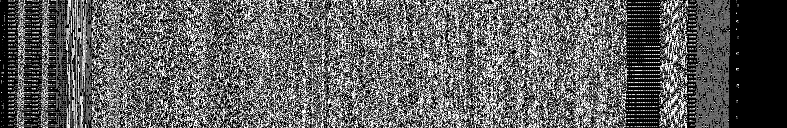

SVFORTH - A Forth for Security Analysis and Visualization
=========================================================
Wes Brown

wes@ephemeralsecurity.com

Ephemeral Security

October 1, 2013

Preamble
--------
The author is conducting a workshop on using visualization to assist in malware, threat, and security analysis.  A lot of the workshop will be running on the SVFORTH platform which is used to exhibit and share visualization and analysis techniques.  This technical paper goes into detail on SVFORTH and the rationale behind it.

SVFORTH is a [Forth \[0\]](http://en.wikipedia.org/wiki/Forth_(programming_language)) language environment written in JavaScript with primitives and functions that make it useful for security visualization and analysis work.  It is intended to be run in a recent browser for the workshop and includes libraries for metadata and binary manipulation as well as image display.

Forth? Really?
--------------
The author is well known for his penchant for developing and using unusual domain specific languages such as Mosquito Lisp to explore and implement new ideas.  Previous research has been conducted to apply [Forth as a first stage injection payload \[1\]](http://mtso.squarespace.com/chargen/2009/1/10/applicable-lessons-from-the-embedded-world-aka-forth-rules.html).  The language of implementation shapes thought patterns, and disparate thought patterns in turn enable a variety of different modalities.  Reframing the problem set with alternate modalities and non-standard paradigms is a time-tested technique for executing successful problem analysis.

For example, Lisp and other functional languages that allow high order functions and lazy evaluations enable the passing of functions to customize the behavior of the function that is being passed to.  The concept of equivalence between data and code allows for models of rapid development that sometimes yield surprisingly elegant and effective code.

Similarly, Forth has a lot to offer in its stack oriented nature.  Programming in a stack based manner is a paradigm shift similar to the difference between functional, object oriented, and procedural languages.  Forth encourages a layered approach to programming due to the ease of defining short functions that operate on the stack.

Much of the visualization and analysis work revolves around the manipluation of query results and sorting data to given criteria.  These results tend to be linear, or in the form of multiple rows, lending itself very well to being operated on like a stack.

In JavaScript?
--------------
Forth is a very simple language to implement; the interpreter parses for the next word, using whitepace as a delimiter.  When the parser encounters a word, it does a lookup against its dictionary to determine if there is code bound to that word.  Forth words typically operate directly upon the stack, popping the values it needs off, and pushing the results on.

This made it very trivial to implement a working Forth interpreter in JavaScript.  Forth words have traditionally been either compiled Forth statements or assembly language.  Similarly, by leveraging JavaScript's closures and anonymous functions, we are able to bind JavaScript functions in the Forth word dictionary.

In SVFORTH, virtually all Forth words are bound to JavaScript functions, even the lowest level stack operators.  Each Forth word is passed a callback function as its sole argument to execute upon completion of its task.  Most Forth word operates upon the stack as the primary data source.

By writing SVFORTH in JavaScript, several advantages immediately appear:

* Much [leading edge research \[2\]](http://www.techrepublic.com/resource-library/whitepapers/bootstrapping-a-self-hosted-research-virtual-machine-for-javascript/) has been done in the area of JavaScript optimization and virtual machine design.
* JavaScript can run virtually anywhere, including the data center and mobile devices.
* There is a rich library of functionality available that is especially useful for the visualization and analysis work that SVFORTH is intended for.
* [JavaScript's passing of closures \[3\]](http://lostechies.com/derekgreer/2012/02/17/javascript-closures-explained/) work very well for binding JavaScript functions to Forth words.
* Writing more words is very easy in JavaScript allowing SVFORTH to be extensible for specific purposes.

Quick SVFORTH Primer
--------------------

Forth works as such:

* `10 20 30 + *` -- this is entered in the REPL
* `10`, `20`, `30` are individually pushed onto the stack, and the stack contents are:
```
  1. 30
  2. 20
  3. 10
```
* The `+` word is encountered, looked up in the dictionary, and executed.  `+` pops the top two items, adds them together, and pushes the result back onto the stack:
```
  1. 50
  2. 10
```
* At this point, the `*` word is encountered and executed similarly to `+`, resulting in:
```
  1. 500
```

Sometimes it can be more illuminating to illustrate in code than it is to explain.  Below are some sample SVFORTH words implemented in JavaScript:

```javascript
  this.canvas = function(callback) {
    currCanvas = document.getElementById( stack.pop() )
    currContext = currCanvas.getContext("2d")
    executeCallback(callback)
  }

  this.fillStyle = function(callback) {
    b = stack.pop()
    g = stack.pop()
    r = stack.pop()
    currContext.fillStyle = "rgb(" + [r,g,b].join(",") + ")"
    executeCallback(callback)
  }

  this.fillRect = function(callback) {
    y2 = stack.pop()
    x2 = stack.pop()
    y1 = stack.pop()
    x1 = stack.pop()
    currContext.fillRect(x1, y1, x2, y2)
    executeCallback(callback)
  }

  Word("pickcanvas", this.canvas)
  Word("fillcolor", this.fillStyle)
  Word("rect", this.fillRect)
```

As mentioned earlier, all SVFORTH words operate upon the stack.  To pass arguments to SVFORTH words, the user has to push them onto the stack.  These specific examples do not push results back, but instead operate upon the HTML canas.  Once the JavaScript functions are defined, they are bound and stored in the SVFORTH dictionary using the `Word()` helper.

Below is an example of an actual SVFORTH program, `randrect` that randomly splashes different color rectangles as fast as possible.

```
: pickcolor
  0 255 rand 0 255 rand 0 255 rand    ( red, green, blue )
  fillcolor ;                         ( set our color )

: randrect
  0 800 rand 0 600 rand               ( upper left coordinates )
  0 800 rand 0 600 rand               ( lower right coordinates )
  rect ;                              ( actually draw the rectangle )

: randrect
  canvas pickcanvas                   ( we find our canvas on our HTML page )
  200 tokenresolution				          ( how many tokens before setTimeout )
  begin
    pickcolor                         ( pick and set a random color )
    putrect                           ( draw a rectangle in a random )
  again ;
```


_Figure 1: randrect running in Chromium_

In SVFORTH, words written in Forth are treated the same as words written in JavaScript; as the token interpreter is concerned, there is no difference between the two with the exception that writing and binding a JavaScript word from within the Forth environment is not implemented for security reasons.

The `randrect` code shows how to define a Forth word; `:` puts the interpreter in a special definition mode which is stored when ';' is encountered.  The definition block is tokenized and compiled before being stored in the dictionary keyed to the word.

Forth as a Query Language
-------------------------
Due to the ability to define words that operate upon datasets as well as the stack based nature of Forth, SVFORTH lends itself very well to being a data query and filtering language.

By layering words, a query can be constructed that pulls data from a database or a data source.  Forth words that are filters that iterate through the stack can remove items that do not match their criteria.  There can also be Forth words that transform the data in an useful way.

In an actual production application of SVFORTH, queries like the following can be made:

```
twitter 500 from #anonymous filter
```

That specific instance of SVFORTH supports an 'easy mode' where queries can be made in prefix rather than postfix notation:

```
from twitter 500 filter #anonymous
```

`from` is a Forth word that takes as arguments from the stack the data type to pull, and the amount to pull.  If all goes well, and we have at least five hundred Twitter posts in our data source, our stack will be filled with JavaScript data structures, one for each Twitter post.

SVFORTH leverages JavaScript in it's native support for JSON and JavaScript data structures.  SVFORTH supports storing these structures as elements on the stack as a datatype beyond the integers that classical Forth supports.

The useful thing about this is that `from` can be arbitrarily redefined as needed for different types of data sources, such as a text file, a SQLite database, a server request over HTTP, or even straight from a Postgres/MySQL server.

Once the stack is populated with the results of the execution of `from`, the `filter` word is then applied removing all items from the stack that does not contain the argument in question, `#anonymous`.

By applying filters, the user then has all Twitter posts that mention the `#anonymous` hashtag out of the results.  It is trivial at this point to drill down and narrow the scope as subsequent filters will remove items from the stack until the desired data is found.

For example, `loic filter` can be invoked on the results of `anonymous filter` to find all `#anonymous` hashtags that mention their Low Orbit Ion Cannon.  This can also be stringed together as such:

```
twitter 500 from #anonymous filter loic filter
```

Due to the ease of defining words in Forth, an analyst can define a vocabulary of special purpose words that conduct queries and refine the results.  An useful example would be a custom algorithm that sorts the results by sentiment value, iterating through the stack and pushing up and down elements as needed.

Furthering the use of this capability, these filtering and sorting words can be written in native JavaScript.  The `filter` word itself is written in JavaScript, though it treats the data in a very Forth-like fashion by rotating the stack:

```javascript
  this.filter = function(callback) {
      filterTerm = stack.pop();
      depth = stack.depth();
      for (var count=0; count < depth; count++) {
          examine = stack.pop();
          if ('data' in examine) {
             if (examine.data.search(filterTerm) > 0) {
                stack.push(examine);
             }
          }
          stack.rot();
      }
      executeCallback(callback);
  }

  Word( "filter", this.filter );
```

Stack Views
-----------
The next piece that makes SVFORTH useful for the domain of security analysis and visualization is the support for different views of the stack.  Each artifact that is stored in the stack has metadata associated with it that may be useful for different contexts such as timestamp, source, type, and origin.

An illustrative example in the area of malware analysis is visualization of assembler opcodes or aligned binaries.  JavaScript's recent support for Typed Arrays allows binary data to be stored directly in memory; this allows for far more performant access and manipulation of this data than the old method of working with Arrays and using `chr()`.

Binary data can be viewed in many ways such as a hexadecimal view, a disassembly view, or more usefully, an entropy and binary visualization map.  The artifact data in the stack remains the same when switching between different views of the same binaries and metadata; this is a key point of how SVFORTH represents the data.  If it is filtered via some mechanism, pivoting on a view will not reset the filter.

Users intuitively see a stack as being top to bottom, and vertically oriented.  For this reason, binary artifacts are shown oriented counterclockwise 90 degrees to make the most of horizontal screen space.  A 76.8K binary file can be represented as a 128x600 wide map, if a pixel is allocated to represent each byte.

Below are examples of different views of the same binary, a Zeus trojan variant:


_Figure 2: mapping 8-bit aligned values to grayscale_


_Figure 3: Zeus binary, mapping only opcodes to grayscale_


_Figure 4: Zeus binary, overlaying color for each PE section_


The above figures illustrate the usefulness of different views of the same binary data.  The opcode view is dramatically different from the pure binary view; the colorized opcode view is useful for comparing data based on section, but it obscures the binary details themselves.

The below sequence shows three different Zeus binaries next to each other:




_Figure 5: Binary view of three Zeus samples_


_Figure 6: Opcode view of three Zeus samples_


_Figure 6: Opcode view of three Zeus samples overlaid with section colors_

Despite the first two Zeus samples being of different sizes, 95K and 141K respectively, there are definite structural similarities visible to an analyst when scaled next to each other.

SVFORTH allows the sorting of these artifacts according to criteria given interactively; changes in the stack will automatically update the views.  One of the key advantagess of SVFORTH running locally on the browser is the latency between intent and response is minimized.

By using metadata on the artifacts, such as timestamps, SVFORTH is able to provide the analyst useful tools such as frequency analysis and a histogram of occurrences or spotting.  When clustering similar variants with each other, tags can then be applied to each; once tagged, the view can be resorted according tag groups.

Other Applications of SVFORTH
------------------------------

In production and experimental usage, SVFORTH has been used to:

* Analyze MacOS X Crash Dumps from Pastebin to be analyzed by Crash Analyzer to direct exploit research
* Search and query intelligence artifacts in a database for further analysis and filtering.  These artifacts are from multiple data sources and different types but SVFORTH is able to unify them on the same stack.
* Build relationship maps based on monitored Twitter conversations
* Perform ordering of binaries in the stack based on similarity criteria based on hashes, entropy, and [Levenshtein distance](http://en.wikipedia.org/wiki/Levenshtein_distance) to cluster malware variants

Implementation Details
----------------------
The central two objects in SVFORTH is the `Stack` and the `Dictionary`.  The `Stack` contains an `Array()` as a private variable, and exposes stack functions such as `pop`, `push`, `dup`, and `swap`.  It should be noted that even essential primitive operators such as these are found as words in the Dictionary() and are themselves JavaScript closures.

```javascript
  // push - [ d ], ( a b c ) -> ( a b c d )
  this.push = function(item, callback) {
    __stack.push(item);
    executeCallback(callback);
  }

  // drop - ( a b c ) -> ( a b ), []
  this.drop = function(callback) {
     __stack.pop();
     executeCallback(callback);
  }
```

Due to the nature of interacting with JavaScript in an asynchronous fashion, every Forth word needs to take the callback as its sole argument and execute it when done.  This callback is typically to the `nextToken()` function to advance the Forth parser's execution, and is passed in as an anonymous closure.  This causes the execution of the Forth program to be synchronous, only moving on to the next token once the current token has completed executing.

The calls to `nextToken()` are wrapped in a function that counts tokens.  When a certain amount of tokens have executed, `setTimeout()` is called.  The single-threaded nature of JavaScript requires this, or the browser will lock up while VSFORTH is interpreting tokens.

```javascript
  function nbNextToken(tokens) {
    tokenCount += 1
    if ( ( tokenCount % self.tokenResolution ) != 0 ) {
      nextToken( tokens )
    } else {
      setTimeout(function () { nextToken( tokens ) }, 0)
    }
  }
```

There is no loop construct in the core interpreter driving execution; instead, the intepreter is recursively called using `nextToken()` passed to the Forth words as callbacks.

```javascript
  function nextToken(tokens) {
  ...
      if ( typeof currToken == 'function' ) {
        currToken( function () { nbNextToken(tokens) } )
      // We check the dictonary to see if our current token matches a word.
      } else if (currToken in dictionary.definitions) {
        word = dictionary.getWord( currToken )
        if ( typeof( word ) == 'function' ) {
          word( function () { nbNextToken(tokens) } )
        } else {
          self.parse( word, function () { nbNextToken(tokens) } )
        }
  ...
```

A sharp-eyed reader might note that the token stream can have JavaScript functions embedded in them.  This is due to the compilation ability of SVFORTH where frequently called functions such as those in a word definition or a loop are tokenized and word lookups performed ahead of time, storing JavaScript functions directly into the token array.

```javascript
  this.compile = function (tokens) {
    for (var tokenIndex in tokens) {
      if ( typeof(tokens[tokenIndex]) == 'string' ) {
        token = tokens[tokenIndex]

        if ( tokens[tokenIndex] in dictionary.definitions ) {
          tokens[tokenIndex] = dictionary.getWord( token )
        } else if ( tokens[tokenIndex] == "" ) {
          tokens.splice(tokenIndex, 1)
          tokenIndex = tokenIndex - 1
        } else if ( !isNaN(tokens[tokenIndex]) ) {
          tokenInt = parseInt(tokens[tokenIndex])
          tokenFloat = parseFloat(tokens[tokenIndex])
          if ( tokenInt == tokenFloat ) {
            tokens[tokenIndex] = tokenInt
          } else {
            tokens[tokenIndex] = tokenFloat
          }
        } else if ( token == "(" ) {
          tokens.splice(tokenIndex, tokens.indexOf( ")" ) - tokenIndex + 1)
          tokenIndex = tokenIndex - 1
        }
      }
    }
    return tokens
  }
```

When the compiler is called upon a token stream, for each token found, it does a dictionary lookup on the token; if there is a match, the string is replaced with the corresponding JavaScript function object.  Also replaced are strings that are numbers, with either a `Float()` or `Int()`.  Tokens following blocks begun by `(` are discarded until a `)` token is hit.  This process is very similar to classical Forth's compilation of Forth words into assembler; doing all the dictionary lookups ahead of time and inserting JavaScript closures in place of tokens has been observed to dramatically increase the speed of VSFORTH in loops.

Much of VSFORTH's functionality is split up into modules that the user can import as needed.  Simply importing `vsforth.js` will set up the `Dictionary` and `Stack`; importing further modules such as `vsforth/canvas.js` will automatically add new words to the `vsforth.js` namespace.  This allows the user to import only modules that are needed, and offers the ability to easily extend the VSFORTH environment.

Possible Futures for SVFORTH
-----------------------------
Forth was originally designed to allow for defining words in assembly, and compiling definitions to assembly.  SVFORTH works similarly in allowing JavaScript functions to be stored in the dictionary.  But what if SVFORTH could really permit assembler like the tradititonal Forths?

This is where `asm.js` steps in.  `asm.js` is a subset of JavaScript that can be compiled to machine assembler by an ahead-of-time engine.  Because it is JavaScript, it can run in browsers and environments that do not natively support `asm.js`.  Currently, Mozilla's Spidermonkey engine is the only one that supports this, and will execute `asm.js` much more quickly.

While `asm.js` was intended to be a compile target rather than as a platform, SVFORTH can be rewritten into `asm.js` with the assembler heap taking the place of the current JavaScript `Array()`.

Another possible avenue of future research is implementing WebGL visualization, and leveraging GPUs to speed up the visualization rendering even more.  This would open up avenues of exploration into 3D visualization for this particular problem space.

Source Code
-----------
The non-proprietary bits of SVFORTH are available via the GPL license via GitHub at:

<https://github.com/ephsec/svforth> [4]

Many Thanks To
--------------
* Daniel Clemens of [PacketNinjas](http://www.packetninjas.com) [5] for giving the author a playground to develop the concepts that this paper discusses
* Daniel Nowak of [Spectral Security](http://www.spectralsecurity.com) [6] for reviewing and feedback

References
----------

0. <http://en.wikipedia.org/wiki/Forth_(programming_language)>
1. <http://mtso.squarespace.com/chargen/2009/1/10/applicable-lessons-from-the-embedded-world-aka-forth-rules.html>
2. <http://www.techrepublic.com/resource-library/whitepapers/bootstrapping-a-self-hosted-research-virtual-machine-for-javascript/>
3. <http://lostechies.com/derekgreer/2012/02/17/javascript-closures-explained>
4. <https://github.com/ephsec/svforth>
5. <http://www.packetninjas.com/>
6. <http://www.spectralsecurity.com/>